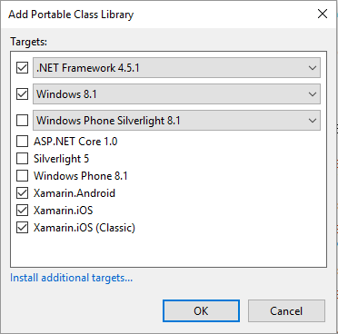
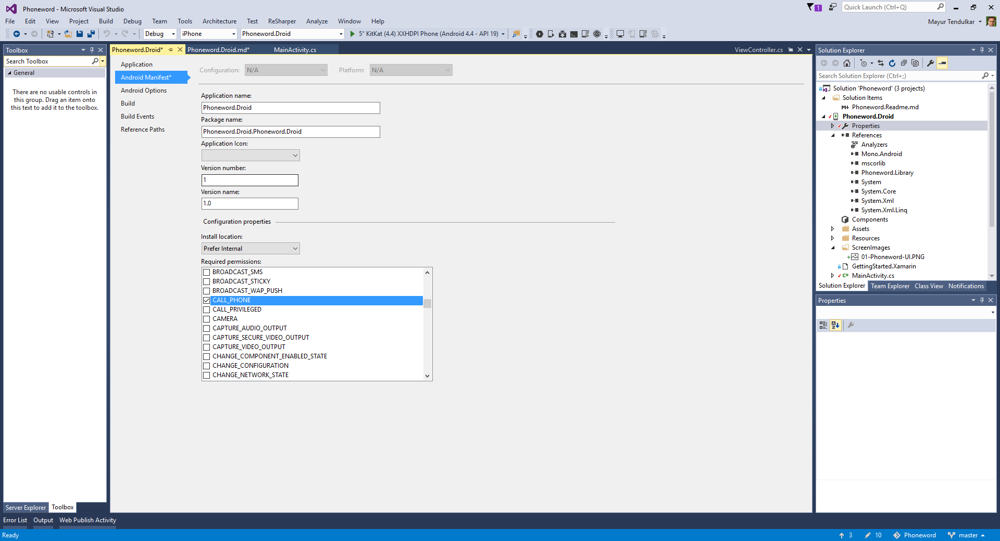

# Phoneword - 'Hello World' for Mobile Developers

**Overview:**

When someone starts to learn programming, the first chapter is always a 'Hello World', be it printing it in C/C++, displaying it in HTML web page or popup message box in desktop application. 
As this lab is aimed for mobile applications, let's build a mobile app which will make use phone functionality and make a phone call.

**Requirements:**

This lab requires Xamarin components installed on Mac or on Windows. 

**Building Phoneword App:**

Create a blank Visual Studio solution with name Phoneword. In this solution create three projects as:

- Portable Class Library Project: Phoneword.Library

For this project make sure Xamarin.Android and Xamarin.iOS is selected as targets on next screen.



- Android 'Blank App' Project : Phoneword.Droid
- iPhone 'Single View Application' Project: Phoneword.iOS

Alternatively, download this repository and start modifying the existing projects.

Now, let's build these projects individually. 

## Phoneword for Android

**Overview**

In this lab, attendees will build their first Android application which will translate the Phoneword and make a phone call. 

**Creating Phoneword.Droid Project**

There are three steps to complete this project

**Step 1: Creating User Interface**

- Create on open existing Phoneword.Droid project and locate Main.axml within Resources > Layout folder. 
- Use drag and drop feature to create user interface for Phoneword. 
- Add EditText to enter the Phoneword. Name it as PhonewordText
- Use Button to translate this Phoneword to a valid phone number. Name it as TranslateButton
- Use Button to call this translated number. Name it as CallButton
- The UI should look like this:


- The following code shows the code behind for this UI

```xml
<?xml version="1.0" encoding="utf-8"?>
<LinearLayout xmlns:android="http://schemas.android.com/apk/res/android"
    android:orientation="vertical"
    android:layout_width="match_parent"
    android:layout_height="match_parent"
    android:minWidth="25px"
    android:minHeight="25px">
    <EditText
        android:layout_width="match_parent"
        android:layout_height="wrap_content"
        android:id="@+id/PhonewordText" />
    <Button
        android:text="Translate"
        android:layout_width="match_parent"
        android:layout_height="wrap_content"
        android:id="@+id/TranslateButton" />
    <Button
        android:text="Call"
        android:layout_width="match_parent"
        android:layout_height="wrap_content"
        android:id="@+id/CallButton" />
</LinearLayout>
```

**Step 2: Adding code behind**

- Add reference to your Phoneword.Library project from Phoneword.Droid project
- In MainActivity.cs write following code above constructor. 

```csharp
 EditText phoneNumberText;
 Button translateButton;
 Button callButton;
 string TranslatedNumber; 
```
- In constructor, set the layout file and assign controls to these variables. Along with it, set event handlers for the button.

```csharp
SetContentView (Resource.Layout.Main);
phoneNumberText = FindViewById<EditText>(Resource.Id.PhonewordText);
translateButton = FindViewById<Button>(Resource.Id.TranslateButton);
callButton = FindViewById<Button>(Resource.Id.CallButton);
```

- Using the PhonewordTranslator class in Phoneword.Library, translate the phoneword. This logic can be added in TranslateButton click event

```csharp
private void TranslateButton_Click(object sender, System.EventArgs e)
{
	TranslatedNumber = PhonewordTranslator.ToNumber(phoneNumberText.Text);
	if (string.IsNullOrWhiteSpace(TranslatedNumber))
	{
		callButton.Text = "Call";
		callButton.Enabled = false;
	}
    else
    {
		callButton.Text = "Call " + TranslatedNumber;
       callButton.Enabled = true;
	}
}
```
- Use TranslatedNumber to make phone call. Write that logic to make a phone call inside CallButton click event

```csharp
private void TranslateButton_Click(object sender, System.EventArgs e)
{
	TranslatedNumber = PhonewordTranslator.ToNumber(phoneNumberText.Text);
	if (string.IsNullOrWhiteSpace(TranslatedNumber))
	{
		callButton.Text = "Call";
		callButton.Enabled = false;
	}
    else
    {
		callButton.Text = "Call " + TranslatedNumber;
       callButton.Enabled = true;
	}
}
```
**Step 3: Running the app**

Android applications require permissions to execute tasks like making a phone call. Open 'Properties' of the application and give permission to call.



Now run the app and see it in action.
